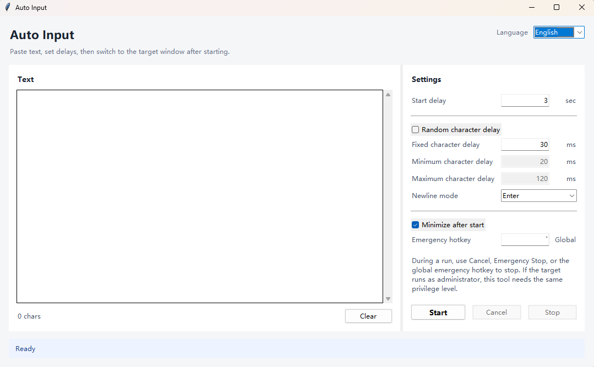

# Auto Input

[中文](README_zh.md)

<p align="center">
  
</p>

Auto Input is a lightweight Windows tool that simulates keyboard typing instead of paste.

It is useful when:

- Paste is disabled, such as in forms, exams, or some apps.
- You need human-like typing with configurable delays.
- You want to automate repetitive text input.

The GUI uses Python's standard `tkinter` library. Text input is sent through the Windows `SendInput` API, so there are no third-party runtime dependencies.

## Run

```powershell
uv run python -m auto_input
```

## Build A Single-File EXE

Use the included PyInstaller build script:

```powershell
.\build-onefile.bat
```

The output will be:

```text
dist\AutoInput.exe
```

The script uses uv to invoke PyInstaller temporarily. PyInstaller is not added as a runtime dependency.

## Features

- Delayed start: gives you time to switch to the target window.
- Per-character delay: supports fixed and randomized delays.
- Randomized character delay: configurable minimum and maximum values.
- Newline modes: `Enter`, `Shift+Enter`, `Ctrl+Enter`, and Unicode newline.
- Emergency stop: available through the in-window button and a global hotkey.
- Configurable emergency hotkey: defaults to the backtick/tilde key, and can be changed to values like `Esc`, `F12`, or `Ctrl+Shift+Q`.
- Cancel support: works while waiting and while typing.
- UI language: switch between Chinese and English from the top-right selector.
- Resizable window: the text area adjusts with the window size.

## Usage

1. Paste the text into the text box.
2. Configure the start delay, character delay, and newline mode.
3. Click Start.
4. Switch to the target input field before the countdown ends.
5. To stop, click Cancel, click Emergency Stop, or press the configured global emergency hotkey.

## Notes

- If the target program runs as administrator, Auto Input must also run as administrator to send input to that window.
- The default newline mode is `Enter`. For chat apps, try `Shift+Enter` or `Ctrl+Enter` to avoid sending the message accidentally.
- The global emergency hotkey is registered only while a task is running and is released automatically when the task ends.
