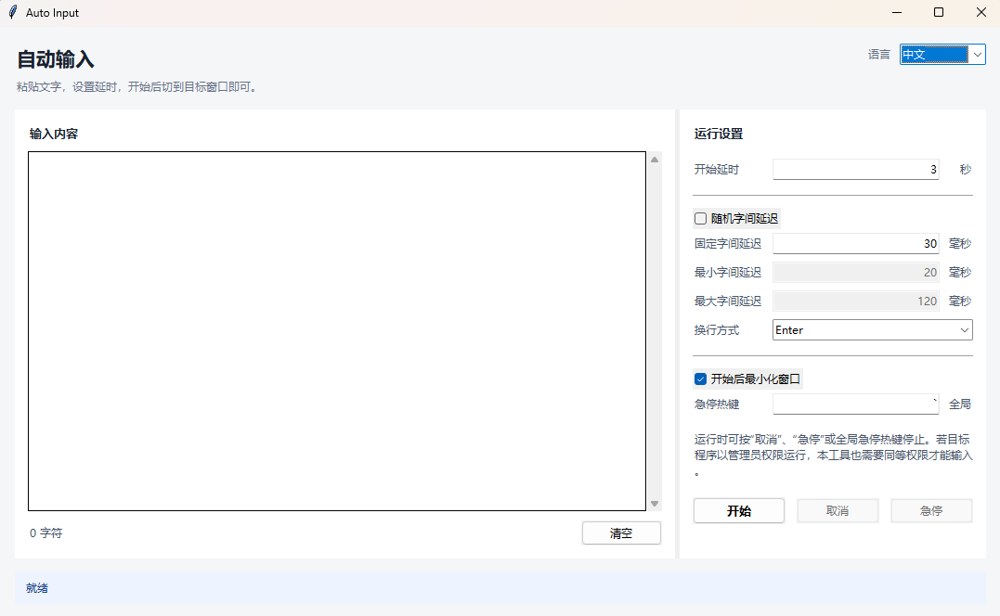

# Auto Input

[English](README.md)

<p align="center">
  
</p>

Auto Input 是一个面向 Windows 的轻量工具，它模拟键盘打字，而不是直接粘贴文本。

适用于：

- 禁止粘贴的场景，例如表单、考试环境或某些应用。
- 需要接近人工输入效果，并且希望配置输入延迟。
- 需要自动化重复性的文本输入。

界面使用 Python 标准库 `tkinter`，输入使用 Windows `SendInput`，运行时不需要第三方依赖。

## 运行

```powershell
uv run python -m auto_input
```

## 打包单文件

项目提供了 PyInstaller 打包脚本：

```powershell
.\build-onefile.bat
```

打包完成后，程序位于：

```text
dist\AutoInput.exe
```

脚本会通过 uv 临时调用 PyInstaller，不会把 PyInstaller 加入运行依赖。

## 功能

- 延时开始输入：开始后先倒计时，方便切换到目标窗口。
- 字间延迟：支持固定延迟，也支持随机延迟。
- 随机字间延迟：可设置最小值和最大值。
- 换行方式：支持 `Enter`、`Shift+Enter`、`Ctrl+Enter`、Unicode 换行。
- 急停：支持窗口内“急停”按钮和全局急停热键。
- 可配置急停热键：默认是反引号/波浪号键，也可设置为 `Esc`、`F12`、`Ctrl+Shift+Q` 等。
- 可取消任务：等待倒计时和正在输入时都可以取消。
- 界面语言：右上角可在中文和 English 之间切换。
- 窗口可缩放：文本区域会随窗口大小调整。

## 使用步骤

1. 在文本框中粘贴要输入的内容。
2. 设置开始延时、字间延迟和换行方式。
3. 按“开始”。
4. 在倒计时结束前切换到目标输入框。
5. 如需中止，按“取消”、“急停”或配置好的全局急停热键。

## 注意事项

- 如果目标程序以管理员权限运行，本工具也需要以管理员权限运行，才能向目标窗口发送输入。
- 默认换行方式是 `Enter`。如果目标是聊天软件，建议尝试 `Shift+Enter` 或 `Ctrl+Enter`，避免单独 `Enter` 直接发送消息。
- 全局急停热键只在任务运行期间注册，任务结束后会自动释放。

## 致谢

感谢 [LinuxDo社区](https://linux.do/)。

真诚、友善、团结、专业，共建你我引以为荣之社区。
